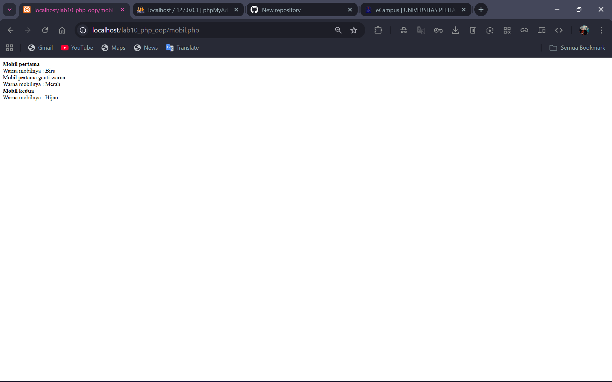
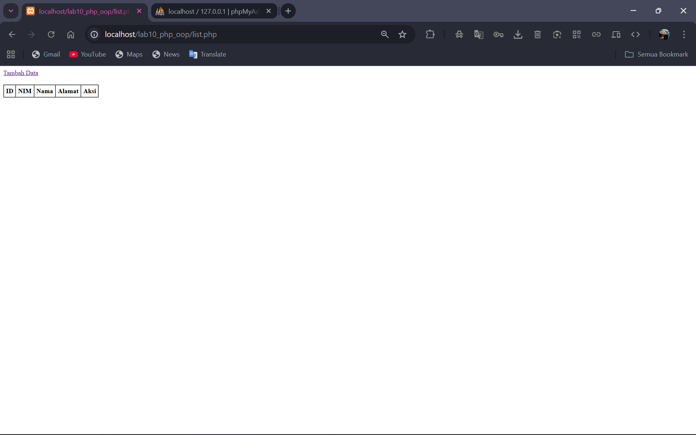
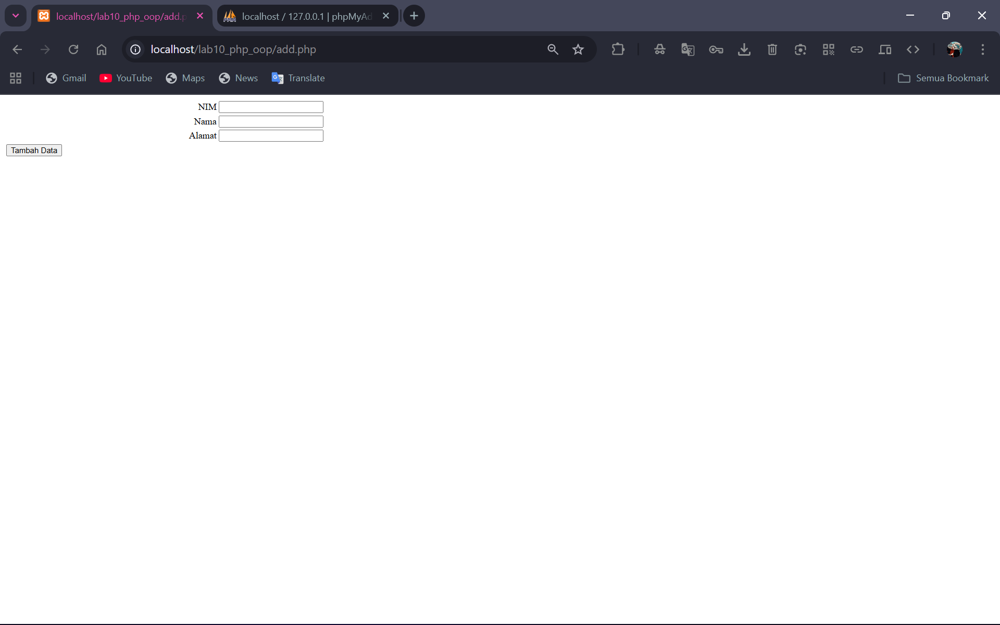
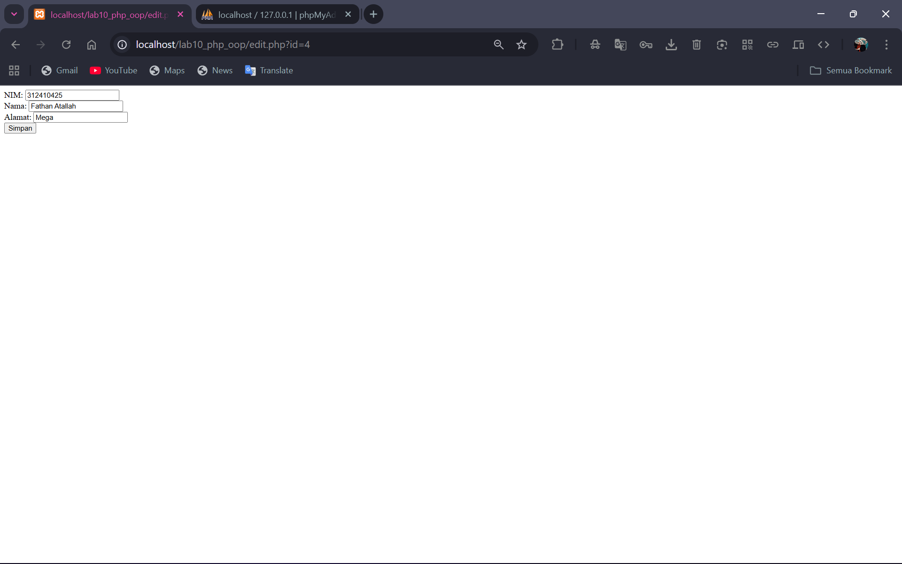
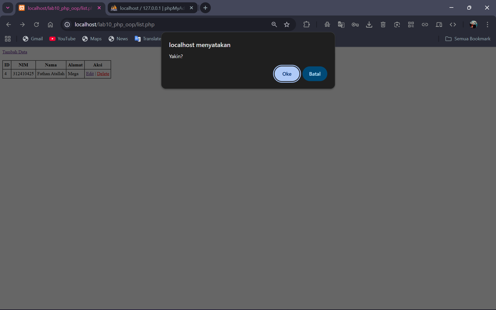

# Lab10Web
# Praktikum 10 — PHP OOP & Modularisasi  
Mata Kuliah: Pemrograman Web  
Nama  : Fathan Atallah Rasya Nugraha 
NIM   : 312410425
Kelas : TI.24.A3

---

##   Tujuan Praktikum
Praktikum ini bertujuan untuk memahami dan menerapkan:

1. Konsep **OOP (Object Oriented Programming)** dalam PHP.  
2. Pembuatan **class**, **object**, **property**, **method**, dan **constructor**.  
3. Pembuatan **Class Library** (modularisasi) untuk Form dan Database.  
4. Implementasi CRUD dengan **pendekatan OOP + modularisasi**.  
5. Struktur folder aplikasi yang rapi dan mudah dikembangkan.

---

## Struktur Folder (Lab10Web)
lab10_php_oop/
├── mobil.php<br>
├── form.php<br>
├── form_input.php<br>
├── database.php<br>
├── config.php<br>
├── index.php<br>
├── list.php<br>
├── add.php<br>
├── edit.php<br>
├── delete.php<br>
└── README.md<br>


---

## **Latihan OOP – File `mobil.php`**

File ini adalah contoh sederhana penggunaan konsep OOP:
- Membuat **class Mobil**
- Menggunakan property private
- Constructor
- Method `gantiWarna()` dan `tampilWarna()`
- Membuat objek mobil A dan B




---

**Class Library Form – File** `form.php`
Digunakan untuk membuat form secara modular dan dinamis.

Fitur:
- Menambah field input
- Menampilkan form otomatis
- Modular dan reusable

Code :
```php
<?php
// form.php
class Form {
    private $fields = array();
    private $action;
    private $submit = "Submit Form";
    private $jumField = 0;

    public function __construct($action = "", $submit = "Submit Form") {
        $this->action = $action;
        $this->submit = $submit;
    }

    public function displayForm() {
        echo "<form action='".$this->action."' method='POST'>";
        echo '<table width="100%" border="0">';
        for ($j=0; $j<count($this->fields); $j++) {
            echo "<tr><td align='right'>".$this->fields[$j]['label']."</td>";
            echo "<td><input type='text' name='".$this->fields[$j]['name']."'></td></tr>";
        }
        echo "<tr><td colspan='2'>";
        echo "<input type='submit' value='".$this->submit."'></td></tr>";
        echo "</table>";
        echo "</form>"; // penting: jangan lupa tutup form
    }

    public function addField($name, $label) {
        $this->fields[$this->jumField]['name'] = $name;
        $this->fields[$this->jumField]['label'] = $label;
        $this->jumField++;
    }
}
```

---

**Class Library Database – File** `database.php`
Class Database menggunakan OOP untuk menangani:
- Koneksi database
- Query
- Insert
- Update
- Delete
- Get (select)

Code :
```php
<?php
// database.php
class Database {
    protected $host;
    protected $user;
    protected $password;
    protected $db_name;
    protected $conn;

    public function __construct() {
        $this->getConfig();
        $this->conn = new mysqli($this->host, $this->user, $this->password, $this->db_name);
        if ($this->conn->connect_error) {
            die("Connection failed: " . $this->conn->connect_error);
        }
    }

    private function getConfig() {
        include_once("config.php");
        $this->host = $config['host'];
        $this->user = $config['username'];
        $this->password = $config['password'];
        $this->db_name = $config['db_name'];
    }

    public function query($sql) {
        return $this->conn->query($sql);
    }

    // Get multiple rows (return array of assoc). 
    // If $where provided, include it (without leading WHERE) e.g. "id=1"
    public function get($table, $where = null) {
        $sql = "SELECT * FROM ".$table;
        if ($where) $sql .= " WHERE ".$where;
        $res = $this->conn->query($sql);
        if ($res === false) return false;
        $rows = [];
        while ($r = $res->fetch_assoc()) {
            $rows[] = $r;
        }
        return $rows;
    }

    public function insert($table, $data) {
        if (!is_array($data) || empty($data)) return false;
        $columns = [];
        $values = [];
        foreach ($data as $k => $v) {
            $columns[] = $k;
            $values[] = "'".$this->conn->real_escape_string($v)."'";
        }
        $sql = "INSERT INTO ".$table." (".implode(",", $columns).") VALUES (".implode(",", $values).")";
        return $this->conn->query($sql);
    }

    public function update($table, $data, $where) {
        if (!is_array($data) || empty($data) || !$where) return false;
        $update_parts = [];
        foreach ($data as $k => $v) {
            $update_parts[] = $k."='".$this->conn->real_escape_string($v)."'";
        }
        $sql = "UPDATE ".$table." SET ".implode(",",$update_parts)." WHERE ".$where;
        return $this->conn->query($sql);
    }

    public function delete($table, $where) {
        if (!$where) return false;
        $sql = "DELETE FROM ".$table." WHERE ".$where;
        return $this->conn->query($sql);
    }
}
```

---

**Implementasi CRUD Menggunakan Modular OOP**
- `list.php`
  Menampilkan semua data mahasiswa.
- `add.php`
  Menggunakan class Form → insert data → redirect.
- `edit.php`
  Mengedit data menggunakan update().
- `delete.php`
  Menghapus data.

---

**Hasil Screenshot**
### Main Page


### Add


### Edit


### Delete

